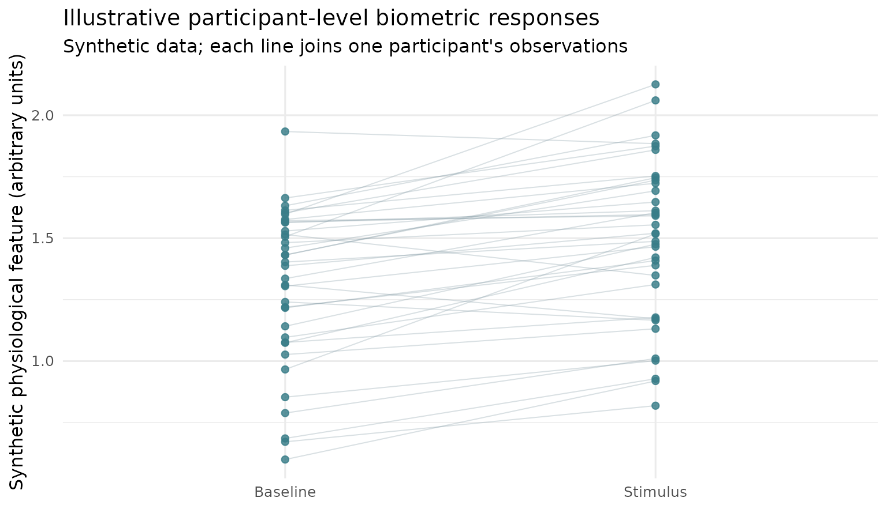
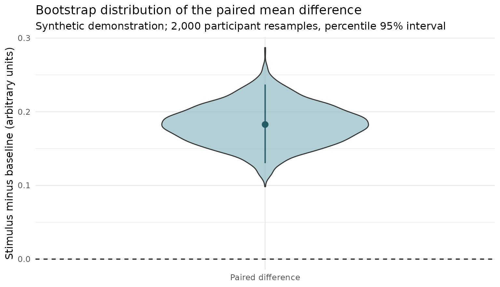

# Estimation graphics: paired observations and effect uncertainty

## An estimation-first view of biometrics outcomes

The [DABEST Python](https://acclab.github.io/DABEST-python/)
visualization grammar combines the distribution of observed outcomes
with uncertainty around a declared effect size. The maintained [R
dabestr package](https://acclab.github.io/dabestr/) is the appropriate
choice for **canonical** Gardner–Altman and Cumming estimation plots,
including its BCa bootstrap procedure.

The two graphics below are **independent, synthetic illustrations**
built with `ggplot2`, not copied from DABEST or presented as validation
data. They illustrate why participant pairing matters for eye tracking,
SCR, pupil and pulse features.

### 1. Show participant-level trajectories, not only a mean bar

``` r

set.seed(20261009)
n_participants <- 36L
demo <- data.frame(
  participant_id = rep(seq_len(n_participants), each = 2L),
  condition = factor(
    rep(c("Baseline", "Stimulus"), n_participants),
    levels = c("Baseline", "Stimulus")
  ),
  response = rep(stats::rnorm(n_participants, 1.4, .28), each = 2L) +
    rep(c(0, .22), n_participants) +
    stats::rnorm(n_participants * 2L, sd = .11)
)
ggplot2::ggplot(
  demo, ggplot2::aes(x = condition, y = response, group = participant_id)
) +
  ggplot2::geom_line(alpha = .27, linewidth = .36, colour = "#718C96") +
  ggplot2::geom_point(
    size = 1.8, alpha = .82, colour = "#387C88"
  ) +
  ggplot2::labs(
    title = "Illustrative participant-level biometric responses",
    subtitle = "Synthetic data; each line joins one participant's observations",
    x = NULL, y = "Synthetic physiological feature (arbitrary units)"
  ) +
  ggplot2::theme_minimal(base_size = 12)
```



### 2. Show the estimated within-participant contrast and uncertainty

The resampling unit here is the **participant**, not a trial, fixation,
frame, or SCR peak. This short example uses a **percentile bootstrap**,
which must not be relabelled as the BCa bootstrap provided by `dabestr`.

``` r

control <- demo$response[demo$condition == "Baseline"]
stimulus <- demo$response[demo$condition == "Stimulus"]
participant_differences <- stimulus - control
effect <- mean(participant_differences)
replicates <- replicate(
  2000L,
  mean(sample(
    participant_differences,
    size = length(participant_differences), replace = TRUE
  ))
)
bounds <- stats::quantile(replicates, c(.025, .975), names = FALSE)
draws <- data.frame(panel = "Paired difference", effect = replicates)
estimate <- data.frame(
  panel = "Paired difference", effect = effect,
  lower = bounds[1L], upper = bounds[2L]
)
ggplot2::ggplot(draws, ggplot2::aes(x = panel, y = effect)) +
  ggplot2::geom_violin(fill = "#8FBAC3", alpha = .7, width = .54) +
  ggplot2::geom_pointrange(
    data = estimate,
    ggplot2::aes(ymin = lower, ymax = upper),
    colour = "#245B65", linewidth = .7
  ) +
  ggplot2::geom_hline(yintercept = 0, linetype = "dashed") +
  ggplot2::labs(
    title = "Bootstrap distribution of the paired mean difference",
    subtitle = "Synthetic demonstration; 2,000 participant resamples, percentile 95% interval",
    x = NULL, y = "Stimulus minus baseline (arbitrary units)"
  ) +
  ggplot2::theme_minimal(base_size = 12)
```



## When this figure is scientifically appropriate

A raw participant-level contrast can be useful for a prespecified
between-person design, a complete paired participant comparison, or a
participant-level summary with defensible denominators. It is **not** a
replacement for mixed models, hierarchical resampling, a model-adjusted
estimand, a repeated-measures agreement analysis, or a test of causal
mediation. Vendor confidence scores and physiological constructs require
separate calibration and validation evidence.

For the experimental package-native plotting APIs, see [gpbiometrics
research PR
\#69](https://github.com/stefanosbalaskas/gpbiometrics/pull/69). Those
methods remain under review; this page does **not** announce a CRAN
version or scientific qualification.
