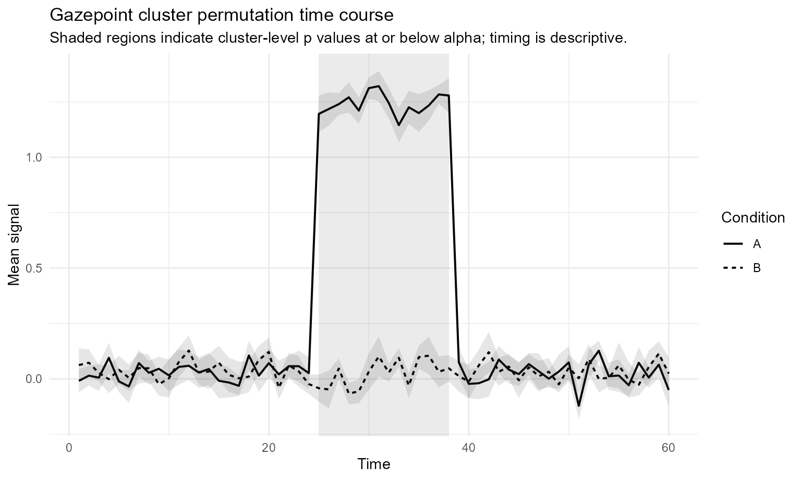

# Experimental cluster-permutation prototype

## Purpose

This article demonstrates the experimental cluster-permutation prototype
in gpbiometrics.

The implementation is deliberately narrow. It currently supports
two-condition, within-subject, one-dimensional time-course comparisons
using participant-level condition time courses.

## Interpretation warning

A significant cluster indicates evidence against the global null of no
condition difference anywhere in the tested time range under the
permutation scheme.

It does not identify a precise onset, offset, latency, or physiological
event boundary. Cluster timing should be treated as descriptive.

## Synthetic example

``` r

library(gpbiometrics)

set.seed(123)

dat <- expand.grid(
  participant = sprintf("P%02d", 1:12),
  condition = c("A", "B"),
  time = 1:60,
  KEEP.OUT.ATTRS = FALSE,
  stringsAsFactors = FALSE
)

subject_shift <- rnorm(12, 0, 0.15)
names(subject_shift) <- sprintf("P%02d", 1:12)

effect_window <- dat$condition == "A" & dat$time >= 25 & dat$time <= 38

dat$value <- subject_shift[dat$participant] +
  rnorm(nrow(dat), 0, 0.18) +
  ifelse(effect_window, 1.20, 0)
```

## Prepare data

``` r

prepared <- prepare_gazepoint_timecourse_test_data(
  data = dat,
  outcome_col = "value",
  time_col = "time",
  condition_col = "condition",
  participant_col = "participant",
  condition_a = "A",
  condition_b = "B"
)

head(prepared)
#>   participant condition time       value
#> 1         P01         A    1 -0.01193249
#> 2         P01         A    2  0.01563383
#> 3         P01         A    3 -0.01573624
#> 4         P01         A    4 -0.12375893
#> 5         P01         A    5 -0.15251212
#> 6         P01         A    6 -0.07664942
```

## Run the test

``` r

result <- run_gazepoint_cluster_permutation(
  data = prepared,
  outcome_col = "value",
  time_col = "time",
  condition_col = "condition",
  participant_col = "participant",
  condition_a = "A",
  condition_b = "B",
  n_permutations = 199,
  cluster_forming_alpha = 0.05,
  cluster_alpha = 0.05,
  seed = 123
)

result
#> Gazepoint cluster permutation test
#> Design: within 
#> Conditions: A - B 
#> Participants: 12 
#> Time points: 60 
#> Permutations: 199 
#> Cluster-forming alpha: 0.05 
#> Cluster-level alpha: 0.05 
#> Clusters: 2 
#>  cluster_id direction start_time end_time n_timepoints       mass p_value
#>           1  positive         25       38           14 222.631208   0.005
#>           2  positive         53       53            1   2.647591   0.685
#>  significant
#>         TRUE
#>        FALSE
```

## Summarize clusters

``` r

summarize_gazepoint_time_clusters(result)
#>   cluster_id direction start_index end_index start_time end_time n_timepoints
#> 1          1  positive          25        38         25       38           14
#> 2          2  positive          53        53         53       53            1
#>   signed_mass       mass p_value significant
#> 1  222.631208 222.631208   0.005        TRUE
#> 2    2.647591   2.647591   0.685       FALSE
```

## Plot result

``` r

plot_gazepoint_cluster_permutation(result)
```



## Current limitations

This prototype does not yet support:

- between-subject designs
- more than two conditions
- factorial designs
- mixed-effects permutation models
- threshold-free cluster enhancement
- exact onset or offset inference
- trial-level exchangeability schemes
- irregular or incomplete time grids

## Recommended wording

Use cautious wording such as:

> The cluster-based permutation test indicated evidence of a condition
> difference in the tested time course.

Avoid stronger wording such as:

> The effect began at time X.

## Development status

This article documents an experimental branch prototype. It should not
be interpreted as a finalized inferential layer until additional
validation, review, and documentation are completed.
