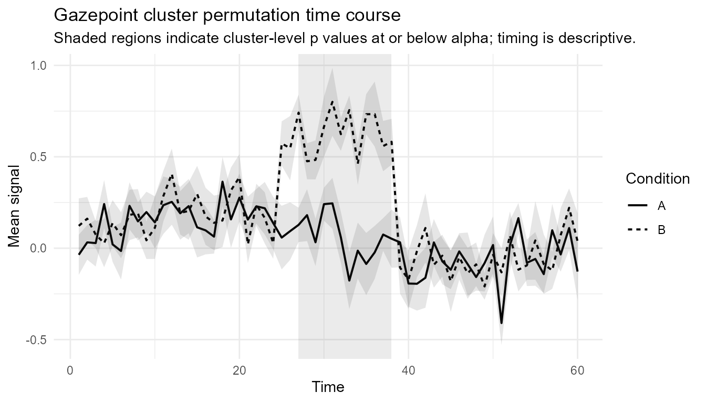
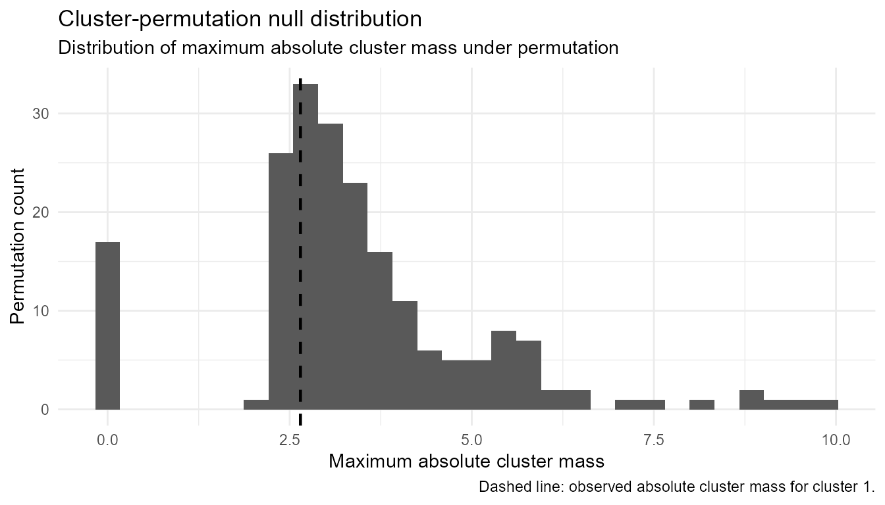

# Cluster-permutation workflow

## Purpose

This article demonstrates the conservative cluster-permutation workflow
in `gpbiometrics` for two-condition, one-dimensional time-course data.

The workflow is intentionally narrow: participant-level time courses,
two conditions, one temporal dimension, cluster mass based on time-wise
test statistics, permutation-based global inference, and descriptive
interpretation of cluster timing.

The goal is not to replace specialist EEG, MEG, pupillometry, or
mixed-model permutation toolboxes. The goal is to provide a transparent,
reproducible, and guarded workflow for Gazepoint-derived time-course
signals.

## Interpretation warning

A significant cluster-permutation result indicates evidence against the
global null hypothesis of no condition difference anywhere in the tested
time range, under the implemented permutation scheme.

It does **not** prove that an effect begins or ends exactly at the
reported cluster boundaries. Cluster timing should be described as a
descriptive interval, not as a precise physiological, attentional, or
cognitive onset or offset.

``` r

library(gpbiometrics)
```

## Simulate example data

We first create a small synthetic two-condition time-course data set.
The example is deliberately synthetic so that the vignette can run
without private participant data.

``` r

set.seed(123)

dat <- simulate_gazepoint_cluster_timecourse_data(
  n_subjects = 12,
  n_time = 60,
  effect_start = 25,
  effect_end = 38,
  seed = 123
)

head(dat)
#>   subject condition time true_effect       value
#> 1     S01         A    1           0  0.02018967
#> 2     S02         A    1           0 -0.01327129
#> 3     S03         A    1           0  0.16734062
#> 4     S04         A    1           0  0.73239235
#> 5     S05         A    1           0  0.23146213
#> 6     S06         A    1           0 -0.35788062
```

## Audit the time-course grid

Cluster-permutation tests require a consistent
participant-by-condition-by-time grid. The audit helper checks whether
the expected cells are present and whether duplicate cells exist.

``` r

grid_audit <- audit_gazepoint_timecourse_grid(
  data = dat,
  subject = "subject",
  condition = "condition",
  time = "time",
  value = "value"
)

grid_audit
#> Gazepoint time-course grid audit
#> --------------------------------
#>  n_rows n_subjects n_conditions n_time_bins expected_cells
#>    1440         12            2          60           1440
#>  observed_unique_cells missing_cells duplicate_cells missing_values
#>                   1440             0               0              0
#>  complete_grid
#>           TRUE
#>
#> The grid is complete.
```

## Diagnose the design

The design diagnostic is a pre-analysis guardrail. It checks whether the
data match the current supported scope: two conditions, repeated
participant observations, and a common time grid.

``` r

design_diagnostic <- diagnose_gazepoint_cluster_design(
  data = dat,
  subject = "subject",
  condition = "condition",
  time = "time",
  value = "value",
  design = "within"
)

design_diagnostic
#> Gazepoint cluster-permutation design diagnostic
#> ------------------------------------------------
#> Design: within
#>
#>                              check passed severity
#>                     two_conditions   TRUE       ok
#>                      complete_grid   TRUE       ok
#>                   minimum_subjects   TRUE       ok
#>  within_subject_condition_presence   TRUE       ok
#>        supported_by_current_runner   TRUE       ok
#>                                                                                      message
#>                                                          Exactly two conditions are present.
#>                               Every participant-condition-time cell is present exactly once.
#>                                                        At least 10 participants are present.
#>                                                Every participant appears in every condition.
#>  The current runner supports the diagnosed within-subject, two-condition time-course design.
#>
#> No blocking design errors were detected.
```

## Prepare participant-level time-course data

The preparation helper keeps the analysis at the
participant-by-condition-by-time level. If raw trial-level samples are
supplied, repeated cells can be aggregated before the cluster test.

``` r

prepared <- prepare_gazepoint_timecourse_test_data(
  data = dat,
  outcome_col = "value",
  time_col = "time",
  condition_col = "condition",
  participant_col = "subject"
)

head(prepared)
#>   participant condition time       value
#> 1         S01         A    1  0.02018967
#> 2         S01         A    2  0.09739217
#> 3         S01         A    3  0.04344428
#> 4         S01         A    4 -0.18120203
#> 5         S01         A    5 -0.23022769
#> 6         S01         A    6 -0.04747587
```

## Run the cluster-permutation test

The example uses a small number of permutations so the vignette builds
quickly. For real analyses, use more permutations and report the exact
settings.

``` r

cluster_result <- run_gazepoint_cluster_permutation(
  data = prepared,
  outcome_col = "value",
  time_col = "time",
  condition_col = "condition",
  participant_col = "participant",
  design = "within",
  condition_a = "A",
  condition_b = "B",
  n_permutations = 199,
  cluster_forming_alpha = 0.05,
  cluster_alpha = 0.05,
  seed = 123
)

cluster_result
#> Gazepoint cluster permutation test
#> Design: within
#> Conditions: A - B
#> Participants: 12
#> Time points: 60
#> Permutations: 199
#> Cluster-forming alpha: 0.05
#> Cluster-level alpha: 0.05
#> Clusters: 3
#>  cluster_id direction start_time end_time n_timepoints      mass p_value
#>           1  positive         53       53            1  2.647591   0.735
#>           2  negative         25       25            1  2.815247   0.655
#>           3  negative         27       38           12 40.347172   0.005
#>  significant
#>        FALSE
#>        FALSE
#>         TRUE
```

## Summarize clusters

The cluster summary reports detected clusters, cluster mass, and
permutation p-values. The time range is useful for description, but it
should not be interpreted as an exact onset or offset.

``` r

cluster_summary <- summarize_gazepoint_time_clusters(cluster_result)

cluster_summary
#>   cluster_id direction start_index end_index start_time end_time n_timepoints
#> 1          1  positive          53        53         53       53            1
#> 2          2  negative          25        25         25       25            1
#> 3          3  negative          27        38         27       38           12
#>   signed_mass      mass p_value significant
#> 1    2.647591  2.647591   0.735       FALSE
#> 2   -2.815247  2.815247   0.655       FALSE
#> 3  -40.347172 40.347172   0.005        TRUE
```

## Plot the result

The plotting helper overlays the two time courses and the detected
cluster information. Use the plot to communicate the pattern, not to
claim exact temporal localization.

``` r

plot_gazepoint_cluster_permutation(cluster_result)
```



## Inspect the null distribution

The null-distribution plot shows the permutation distribution of the
maximum cluster mass. This helps users understand the family-wise
comparison used to evaluate observed clusters.

``` r

plot_gazepoint_cluster_null_distribution(cluster_result)
```



## Check threshold sensitivity

Cluster-forming thresholds affect which adjacent time points enter
clusters. A sensitivity check helps document whether the conclusion is
highly dependent on one arbitrary threshold.

``` r

threshold_sensitivity <- run_gazepoint_cluster_threshold_sensitivity(
  data = prepared,
  dv = "value",
  time = "time",
  condition = "condition",
  subject = "participant",
  thresholds = c(0.025, 0.05, 0.10),
  cluster_alpha = 0.05,
  seed = 123,
  design = "within",
  condition_a = "A",
  condition_b = "B",
  n_permutations = 99
)

threshold_sensitivity
#> Gazepoint cluster-permutation threshold sensitivity
#> ----------------------------------------------------
#>  threshold n_clusters min_p_value n_significant
#>      0.025          6        0.01             3
#>      0.050          3        0.01             1
#>      0.100          2        0.01             1
```

## Generate conservative report text

The reporting helper produces cautious wording. It avoids treating
cluster boundaries as precise onsets or offsets.

``` r

cluster_report <- report_gazepoint_cluster_permutation(cluster_result)

cluster_report
#> The cluster-based permutation test indicated cluster-level evidence of a condition difference in the tested time course: cluster 3 (descriptive time range: 27 to 38, p = .005). The temporal extent of any detected cluster should be interpreted descriptively. The test evaluates evidence against the global null of no condition difference anywhere in the tested time range; it does not provide a precise estimate of effect onset, offset, latency, physiological event boundary, emotion, stress, cognition, diagnosis, or mechanism. Assumptions checked/reported: two-condition comparison; participant-level time courses; common participant-condition-time grid; permutation scheme matched to the supported design; cluster timing interpreted descriptively.
```

## Export results

For reproducibility, the result object can be exported to a temporary
folder. In a real project, use a project-level output folder such as
`outputs/cluster_permutation/`.

``` r

export_dir <- tempfile("gpbiometrics_cluster_export_")
dir.create(export_dir)

exported_files <- export_gazepoint_cluster_results(
  cluster_result,
  path = export_dir,
  prefix = "cluster_example",
  overwrite = TRUE
)

exported_files
#>   component
#> 1  clusters
#> 2  timewise
#> 3      null
#> 4    params
#> 5    report
#>                                                                                                                                      file
#> 1            C:\\Users\\STEFAN~1\\AppData\\Local\\Temp\\RtmpEf8bsZ\\gpbiometrics_cluster_export_a4bc1eda7f11/cluster_example_clusters.csv
#> 2 C:\\Users\\STEFAN~1\\AppData\\Local\\Temp\\RtmpEf8bsZ\\gpbiometrics_cluster_export_a4bc1eda7f11/cluster_example_timewise_statistics.csv
#> 3   C:\\Users\\STEFAN~1\\AppData\\Local\\Temp\\RtmpEf8bsZ\\gpbiometrics_cluster_export_a4bc1eda7f11/cluster_example_null_distribution.csv
#> 4          C:\\Users\\STEFAN~1\\AppData\\Local\\Temp\\RtmpEf8bsZ\\gpbiometrics_cluster_export_a4bc1eda7f11/cluster_example_parameters.csv
#> 5              C:\\Users\\STEFAN~1\\AppData\\Local\\Temp\\RtmpEf8bsZ\\gpbiometrics_cluster_export_a4bc1eda7f11/cluster_example_report.txt
```

## External interoperability

`gpbiometrics` also includes export helpers for users who need to
continue in specialist software. These helpers prepare data and
metadata; they do not claim to run or validate external models.

``` r

mne_input <- export_gazepoint_mne_cluster_input(
  data = prepared,
  outcome_col = "value",
  time_col = "time",
  condition_col = "condition",
  participant_col = "participant",
  condition_a = "A",
  condition_b = "B"
)

names(mne_input)
#> [1] "long"              "difference_matrix" "metadata"
head(mne_input$difference_matrix[, 1:min(6, ncol(mne_input$difference_matrix))])
#>   participant difference.1 difference.2 difference.3 difference.4 difference.5
#> 1         S01   -0.4103243  0.090418986   0.25043962    0.9631278   0.19914925
#> 2         S02   -0.7189504 -0.008582942  -0.08275092    0.4803315  -0.74658849
#> 3         S03    0.5574513  0.223712471  -0.14192049   -0.5330157   0.03391581
#> 4         S04   -0.6534160  0.140769698   0.81765870   -0.5846410  -0.34562261
#> 5         S05   -0.6543950  0.260734609   0.31480729   -0.1537900   1.38469789
#> 6         S06    1.2881728  0.630607825  -0.60969854   -0.3567696  -0.23855517
```

## Advanced guardrails

Some advanced function names are exported deliberately as guardrails.
They fail safely instead of pretending to provide validated ANOVA,
mixed-model, TFCE, multidimensional, covariate-adjusted, parallel, or
onset/offset cluster inference.

``` r

try(run_gazepoint_tfce())
#> Error : `run_gazepoint_tfce()` is not implemented as a runnable inferential engine in gpbiometrics yet.
#>
#> TFCE avoids a fixed cluster-forming threshold but introduces additional parameters and validation requirements. It should not be added until the fixed-threshold cluster workflow has been reviewed and validated.
#>
#> The current validated scope is the conservative within-subject, two-condition, one-dimensional time-course workflow implemented in `run_gazepoint_cluster_permutation()`.
#>
#> Recommended alternative: Use `run_gazepoint_cluster_threshold_sensitivity()` to inspect sensitivity to fixed cluster-forming thresholds.
```

## Recommended wording

Prefer wording such as:

> A two-condition cluster-permutation test indicated evidence of a
> condition difference in the tested time course. The reported cluster
> interval is descriptive and should not be interpreted as a precise
> onset or offset estimate.

Avoid wording such as:

> The effect began exactly at time point X and ended exactly at time
> point Y.

## Current scope

The current validated workflow is suitable for conservative
two-condition time-course analyses. More complex designs should be
handled with specialist tools or treated as future methodological work,
not as automatic extensions of this workflow.
