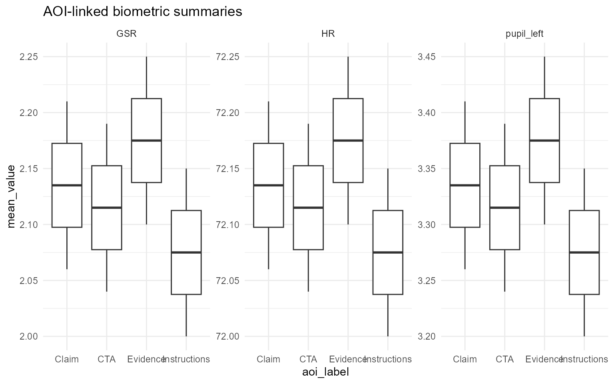
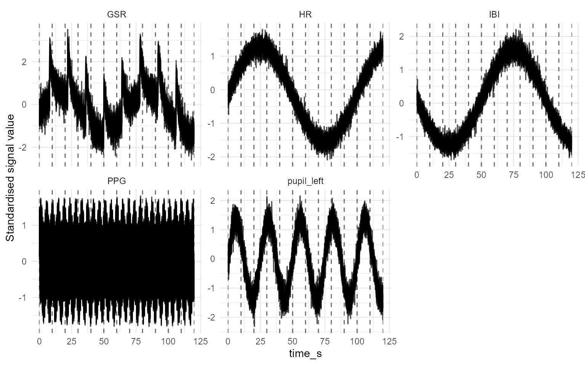
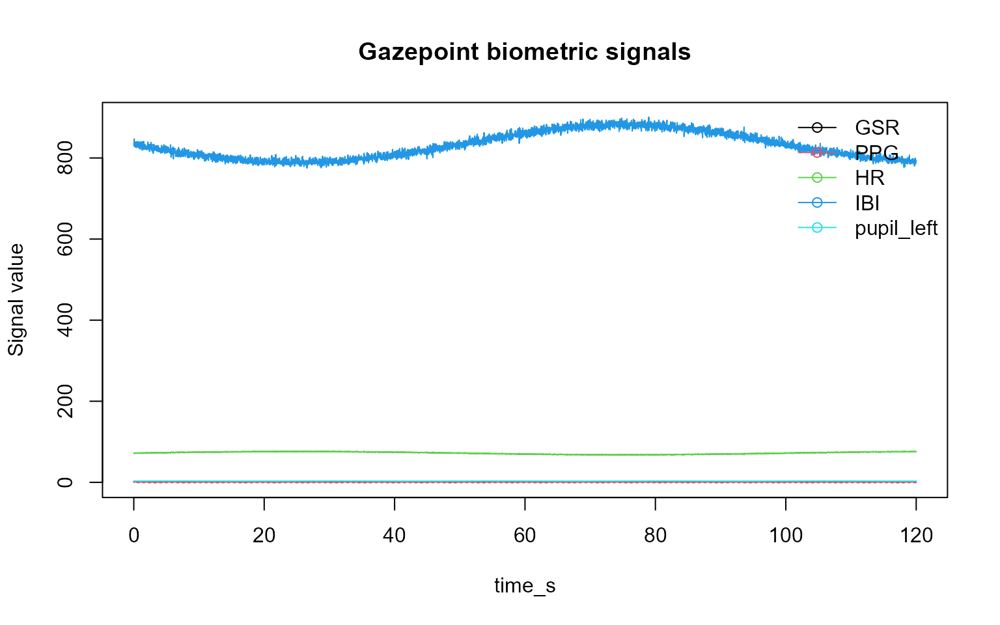
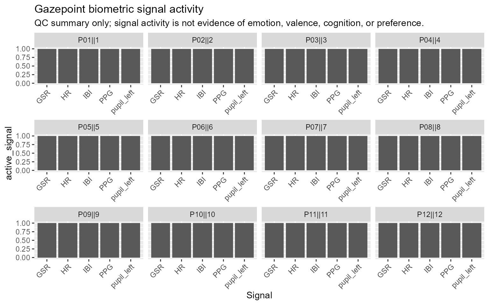
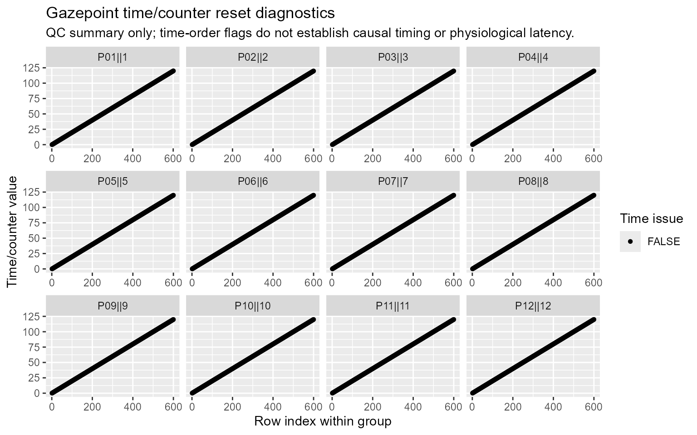
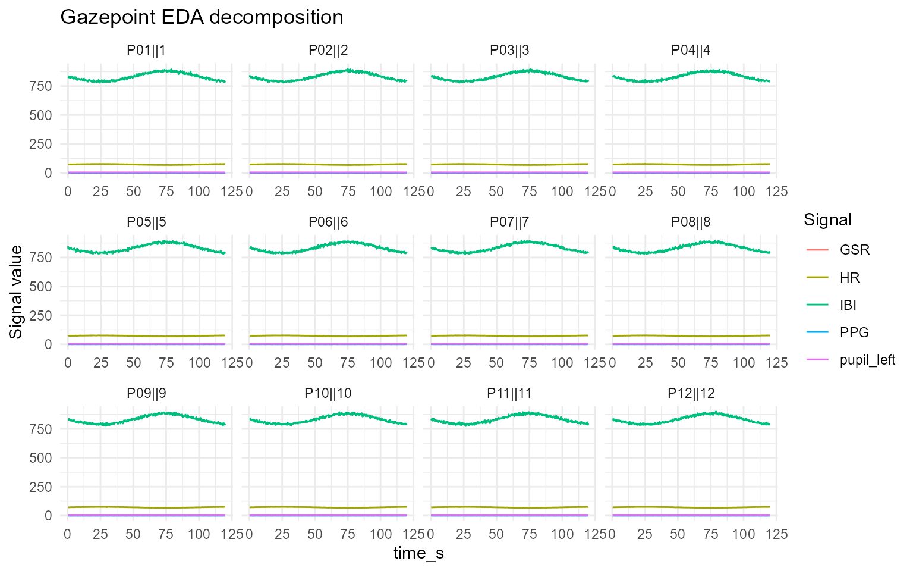
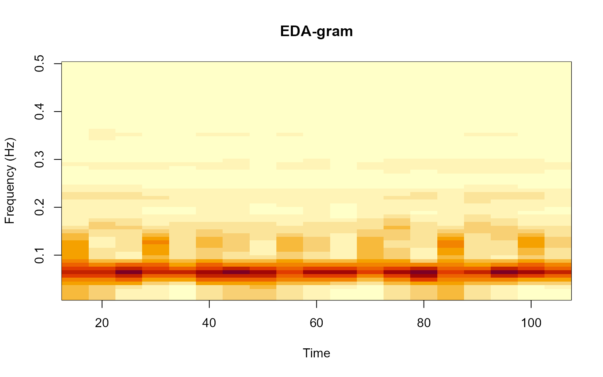
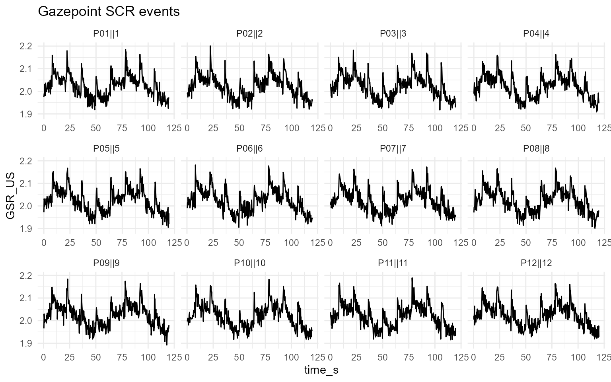
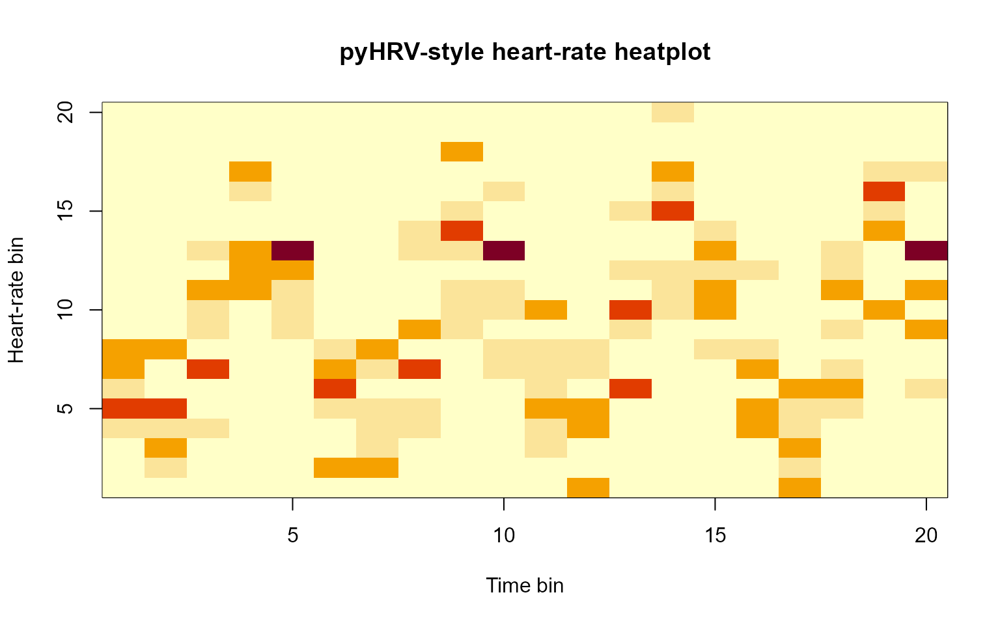

# Plot gallery

## Plot gallery

This article showcases all exported `plot_*` helpers in `gpbiometrics`
using synthetic Gazepoint-like data.

The example code is hidden so that the page functions as a compact
visual gallery. Function names are shown above each rendered example.

The examples are for documentation and visual inspection only. The
synthetic signals are not real physiology and should not be interpreted
as emotion, stress, cognition, preference, health status, or diagnosis.

## AOI and multimodal plots

### `plot_gazepoint_aoi_biometrics()`

### `plot_gazepoint_multimodal_timeline()`

## Biometric quality and signal plots

### `plot_gazepoint_biometric_quality()`

### `plot_gazepoint_biometric_report_dashboard()`

### `plot_gazepoint_biometric_signals()`

### `plot_gazepoint_signal_activity()`

### `plot_gazepoint_time_resets()`

## EDA and SCR plots

### `plot_gazepoint_eda_decomposition()`

### `plot_gazepoint_eda_gram()`

### `plot_gazepoint_scr_events()`

### `plot_gazepoint_scr_specification_curve()`

## PPG, HRV, and respiration plots

### `plot_gazepoint_ppg_breathing()`

### `plot_gazepoint_ppg_peak_detection()`

### `plot_gazepoint_ppg_poincare()`

### `plot_gazepoint_ppg_segmentwise()`

### `plot_gazepoint_pyhrv_hr_heatplot()`

### `plot_gazepoint_pyhrv_radar_chart()`

### `plot_gazepoint_pyhrv_tachogram()`

## Eye-movement plot

### `plot_gazepoint_saccade_main_sequence()`

## Extended QC and reporting plot examples

This section adds representative plot calls for common `gpbiometrics`
quality-control, signal-processing, event-alignment, AOI, reporting, and
toolbox-bridge workflows.

The examples are intended as plotting contracts and documentation
patterns. They show how diagnostic and report-ready figures can be
produced from synthetic or already processed data. They should not be
interpreted as direct evidence of emotion, stress, attention, workload,
clinical status, diagnosis, health condition, or psychological response.

### Missingness and signal-quality plots

Missingness and signal-quality plots are useful for checking coverage
and candidate data-quality issues before modelling.

### Timing and activity plots

Timing and activity plots help document sample availability, active
channels, and possible time-reset issues.

### Raw and processed signal plots

Signal plots should identify the plotted channel and preprocessing
state.

### EDA, GSR, and SCR plots

EDA/GSR/SCR plots document preprocessing, decomposition, and candidate
event detection.

### PPG, IBI, HRV, and respiration-proxy plots

PPG and interval plots document signal-processing and feature-extraction
outputs.

### Event-alignment, AOI, and multimodal plots

Event-alignment and AOI-linked plots show synchronized summaries and
should be reported as feature-engineering outputs.

### Design and reporting plots

Design and reporting plots support auditability and should be kept
separate from substantive interpretation.

### Toolbox-bridge output plots

Toolbox-bridge plots should document algorithmic outputs and export
contracts.

## Reporting note

When using these plots in articles, reports, or supplementary materials,
describe them as diagnostic, quality-control, synchronization,
feature-engineering, or reproducibility displays unless the study design
and validation evidence support stronger interpretation.
